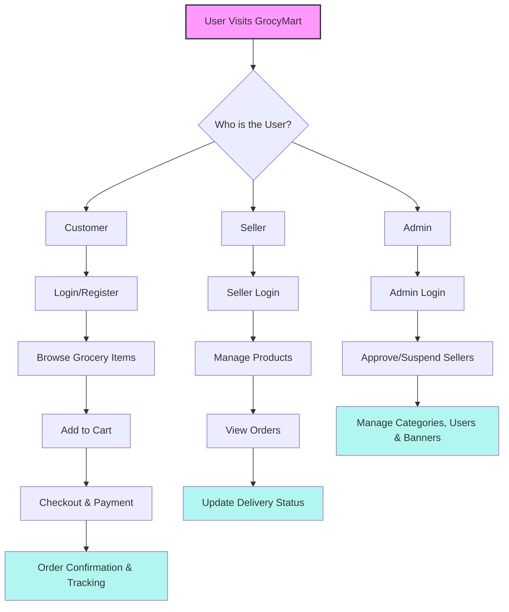

#Shopsmart-Your-digital-grocery-store-experience#
# 🛒 GrocyMart – Your Smart Online Grocery Store

GrocyMart is a dynamic and user-friendly MERN Stack-based web application designed to transform your grocery shopping into a seamless digital experience. Whether you're a customer, a seller, or an admin, GrocyMart offers real-time inventory tracking, secure transactions, and powerful management tools to ensure a smooth and smart shopping journey.

---

## 🚀 Features

### 👨‍👩‍👧‍👦 For Customers:
- Secure sign-up/login with personalized dashboard
- Browse groceries by category, brand, or price range
- Add items to cart and checkout with secure payment integration
- View order history, track deliveries, and manage account

### 🛍️ For Sellers:
- Dedicated seller dashboard to manage products and stock
- Add, edit, or remove grocery items with images, prices, and stock info
- Manage incoming orders and update delivery statuses
- Receive real-time alerts for low stock or new orders

### 🛡️ For Admins:
- Oversee all customer and seller accounts
- Approve or suspend sellers
- Manage grocery categories, promotional banners, and overall system data
- Role-based access to ensure platform security

---

## 🌐 Live Demos

🔗 [Frontend UI – CodePen Demo](https://codepen.io/LIKHITA-P/pen/QwbJJML)  
🔗 [MongoDB Demo – OneCompiler](https://onecompiler.com/mongodb/43nmckj9u)

---

## 🧑‍💻 Tech Stack

### 🔹 Frontend
- React.js  
- Tailwind CSS  
- Axios  
- React Router DOM

### 🔸 Backend
- Node.js + Express.js  
- MongoDB + Mongoose  
- JWT (Authentication)  
- Bcrypt (Password encryption)  
- Multer (Image uploads)  
- Dotenv

### 🛠️ Tools & Libraries
- Nodemon  
- CORS  
- Concurrently  
- MongoDB Atlas  
- Git & GitHub

---

## 📁 Project Structure

```
GrocyMart/
├── frontend/
│   ├── src/
│   │   ├── components/
│   │   ├── pages/
│   │   └── App.js
│   └── public/
├── backend/
│   ├── config/
│   ├── controllers/
│   ├── models/
│   ├── routes/
│   ├── middleware/
│   └── index.js
├── .gitignore
├── README.md
└── package.json
```

---

## ⚙️ Setup Instructions

### 🔧 Prerequisites
- Node.js and npm  
- MongoDB (Atlas or local)  
- Git

### 🖥️ Installation

Clone the repository:
```bash
git clone https://github.com/polamlikhita/GrocyMart.git
cd GrocyMart
```

Install backend dependencies:
```bash
cd backend
npm install
npm start
```

Install frontend dependencies:
```bash
cd ../frontend
npm install
npm start
```

Set up `.env` files:

**backend/.env**
```
PORT=5000
MONGO_URI=your_mongodb_connection_string
JWT_SECRET=your_secret_key
```

**frontend/.env**
```
REACT_APP_API_URL=http://localhost:5000
```

Run both apps simultaneously:
```bash
npm install concurrently --save-dev
npm start
```

---

## 🔄 Application Flow – GrocyMart



---

## 🧪 Testing

- Test backend APIs using Postman  
- Validate JWT-protected routes and user roles  
- Test product search, add-to-cart, checkout, and delivery updates

---

## 👨‍💻 Team Members

- Sadda Meghana  
- Polam Likhita  
- Nama Likhitha  
- Parijata G

---

## 📚 Resources

- MERN Stack Docs  
- Tailwind CSS Docs  
- MongoDB Atlas  
- CodePen & OneCompiler for UI & DB Demos
